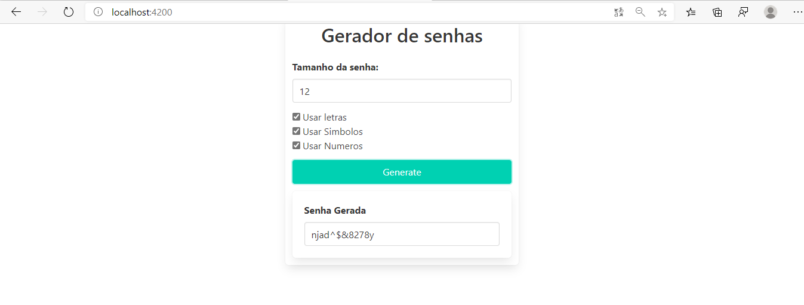

# Geradordesenhas
Um projeto simples com angular gerando senhas usando eventos se quiser ver o projeto em produção só <a href="https://geradordesenhas.gustavo-akira.now.sh/">Clicar aqui</a>
# Verificações
Verifica se ele colocou no minimo o tamanho da senha e uma das opções

# Final
Mostra a senha gerada em uma parte separada
